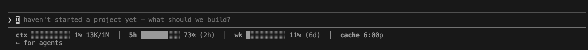

# claudecode-mini-statusbar

A tiny, monochrome status line for [Claude Code](https://claude.com/claude-code): context window, usage limits, and prompt-cache expiry.



I've run this in my own Claude Code for about 6 months. Enough friends asked for a copy that I cleaned it up and open-sourced it. It's deliberately minimal. If you want a fuller, more configurable bar, there are great options like [claude-code-usage-bar](https://github.com/leeguooooo/claude-code-usage-bar).


## What each segment shows

| Segment | Data source | What it does |
| --- | --- | --- |
| `ctx` | The session transcript's latest `usage` block, over the model's `max_input_tokens` from the Models API | Current context fill (matches `/context`); auto-tracks 200K vs 1M per model |
| `5h` / `wk` | `GET /api/oauth/usage` → `five_hour` / `seven_day` `utilization` | Your 5-hour and weekly limit %, with time-to-reset |
| `cache` | Latest assistant turn's `timestamp` + the cache TTL (1h/5m, read from its `cache_creation` buckets) | Local clock time the prompt cache expires (`cache COLD` once it lapses) |

The OAuth token is read live from the credential store Claude Code already manages (macOS Keychain). This tool stores no secret of its own and only makes read-only GETs to `api.anthropic.com`. Both network lookups are cached on disk.
## Setup

```bash
git clone https://github.com/allen-ajith/claudecode-mini-statusbar.git
```

Add to `~/.claude/settings.json`:

```json
{
  "statusLine": {
    "type": "command",
    "command": "PYTHONPATH=/absolute/path/to/claudecode-mini-statusbar python3 -m claude_statusline.statusline"
  }
}
```

Run it as a module (`-m`) with `PYTHONPATH` pointing at the clone — `claude_statusline` uses package-relative imports, so a bare `python3 .../statusline.py` won't work. If your clone path has spaces, quote it: `PYTHONPATH="/path/with spaces/..."`.

Restart Claude Code (or run `/statusline`).

## Options (all optional)

| Env var | Effect |
| --- | --- |
| `CLAUDE_CONTEXT_LIMIT` | Force the context window in tokens |
| `CLAUDE_STATUSLINE_WIDTH` | Bar width in cells (default `10`) |
| `CLAUDE_STATUSLINE_DARK` | Hint grayscale level `0`–`255` (default `238`) |
| `CLAUDE_STATUSLINE_PLAIN` | Disable bold/dim styling |
| `CLAUDE_STATUSLINE_NO_CACHE` | Hide the `cache` segment |

Set them with an `env` block in `~/.claude/settings.json` (values must be strings). 

The two toggles (`CLAUDE_STATUSLINE_PLAIN`, `CLAUDE_STATUSLINE_NO_CACHE`) check presence, not value so `"1"` turns them on; remove the key to turn them off.

Only include keys you want to change:

```json
{
  "statusLine": {
    "type": "command",
    "command": "PYTHONPATH=/absolute/path/to/claudecode-mini-statusbar python3 -m claude_statusline.statusline"
  },
  "env": {
    "CLAUDE_STATUSLINE_WIDTH": "12",
    "CLAUDE_STATUSLINE_DARK": "234"
  }
}
```

Restart Claude Code after editing. 

## License

MIT — see [LICENSE](LICENSE).
